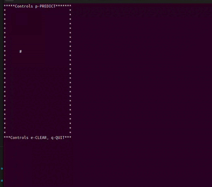

# rustnet
rustnet is a 2 layered neural network written from scratch which uses gradiant descent technique to train on mnist dataset and predict digits from a 28/28 pixel image.

## How to run

* [Install rust](https://www.rust-lang.org/tools/install).
* Make sure `.env` file is present in the root path. (refer to .env_sample for which variables can be set)
* Use the following command to start training the neural network,
```
cargo run < {file_path} ## It takes a while to train as it is not fully optimized yet.
```
* `file_path` should contain the a csv file with 2 dimentional array (the likes of [mnist dataset](https://www.kaggle.com/datasets/oddrationale/mnist-in-csv) from kaggle).
 Remember to remove the first row that contains column labels.
* Training for the first time will create a folder `/results` in the root directory and place the following files,
```
    |- results
    |  |- b_1.csv ## Layer 1 biases.
    |  |- b_2.csv ## Output layer biases.
    |  |- w_1.csv ## Layer 1 weights.
    |  |- w_2.csv ## Output layer weights.
    |...
```
* These will be used to predict the input with `forward_propagation` function.
* Use `cargo test` to run the unit and integration tests and `cargo build` to build the binaries which will be placed in `target/debug` folder. 

## Folder structure
|  |  |  |  |  |
| ------ | ------ | ------ | ------ | ------ |
| \_\_docs\_\_ | Documentation and screenshots folder |  |  |
| /src | source code |  |  |
|  | /common | Module containing function library (this will eventually become a crate) |  |
|  |  | console.rs | console drawing and output functionality |
|  |  | integration_test_vars.rs | variables for integration tests |
|  |  | io.rs | file i/o (reading from/writing to csv files) |
|  |  | matrix.rs | common matrix operations needed for neural network |
|  |  | mod.rs | file/module registree|
|  |  | network_function.rs | functions needed for neural network operation |
|  |  | types.rs | common types and interfaces |
|  | main.rs | Entry point for the binary |  |
|  | lib.rs | Registers the common module also contains rust macros |  |
|  | /tests | Unit and integration tests |  |
|  |  | matrix.rs | Test code |

## Architecture
* m = sample size
```
           OPERATION           DATA DIMENSIONS   WEIGHTS(N)

               Input   #####      m 784
        Scale(1/255)   ||||| -------------------                 
                       #####      m 784
           Transpose   ||||| -------------------
                       #####      784 m
               Dense   XXXXX -------------------    10x784
                relu   #####       10 m
               Dense   XXXXX -------------------     10x10
             softmax   #####       10 m
```

## Additional info
* Folders
<picture>
  
</picture>


* If you wish to debug with vs code here's a sample sonfiguration that works on Ubuntu 22.0 and VS code with 
```
launch.json
{
    "version": "0.2.0",
    "configurations": [
        {
            "type": "lldb",
            "request": "launch",
            "name": "Debug executable",
            "program": "${workspaceRoot}/target/debug/rustnet",
            "args": [],
            "stdio": [
                "${workspaceRoot}/datasets/mnist_test.csv",
                "${workspaceRoot}/out"
            ],
            "console": "integratedTerminal",
            "cwd": "${workspaceRoot}",
            "env": { "RUST_BACKTRACE": "1" },
            "sourceLanguages": ["rust"]
        },
        {
            "name": "Run Test Debugger",
            "type": "lldb",
            "request": "launch",
            "program": "${workspaceFolder}/target/debug/deps/matrix-d7beba04dc891c75",
            "args": [],
            "cwd": "${workspaceFolder}",
            "console": "integratedTerminal",
            "stdio": [
                "${workspaceRoot}/datasets/mnist_test.csv",
                "${workspaceRoot}/out"
            ],
            "preLaunchTask": "cargo test build"
        }
    ]
}
```
```
tasks.json
{
    "version": "2.0.0",
    "tasks": [
        {
            "type": "cargo",
            "command": "cargo test build",
            "problemMatcher": ["$rustc"],
            "group": "test",
            "label": "rust: cargo test",
            "args": ["test", "--no-run"]
        }
    ]
}
```

## DEMO
* Canvas drawin prediction
<picture>
  
</picture>


## TODO
- [x] Build and train neural network.
- [x] Add draw in terminal feature.
- [x] Enable Multi threading for matrix operations.
- [ ] Explore faster matrix operation (e.g. Strassen's algorithm for fast matrix multiplication)
- [ ] Refactoring and optimizations with advanced rust.
